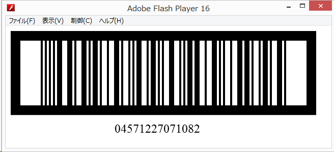

# hxGTIN

hxGTIN is a GTIN (Global Trade Item Number) bar code library, featuring:

- Calculate a GTIN check digit
- Draw a ITF symbol (need OpenFL)

### How to run demo application



1. Install OpenFl. (http://www.openfl.org/documentation/getting-started/installing-openfl/)
2. Open a command-prompt (Windows) or terminal (Mac/Linux).
3. Change to the directory of this project.
4. If you use "flash" instead, the "openfl" command will open a flash player.

```
openfl test flash
```

### License

hxGTIN is licensed under the MIT license. See LICENSE for further details.
